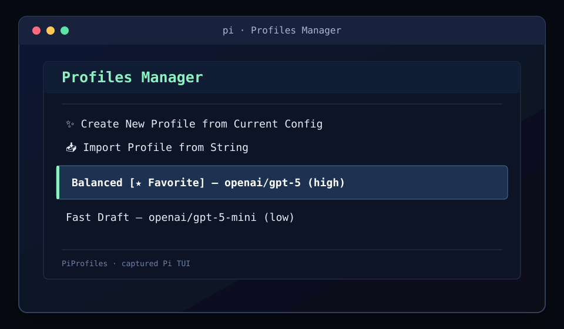
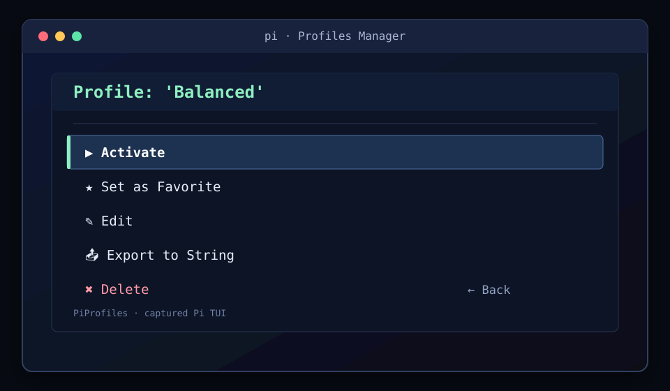
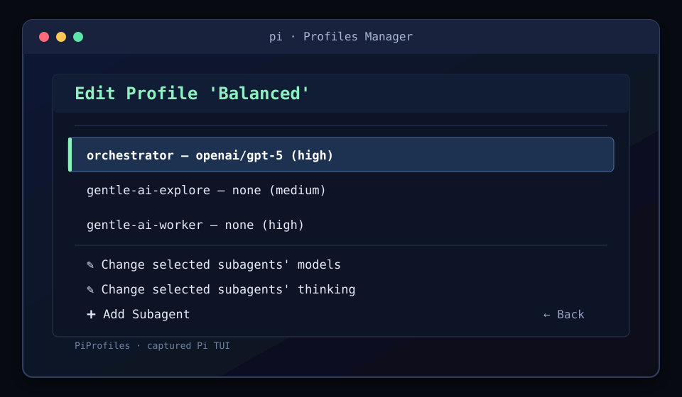
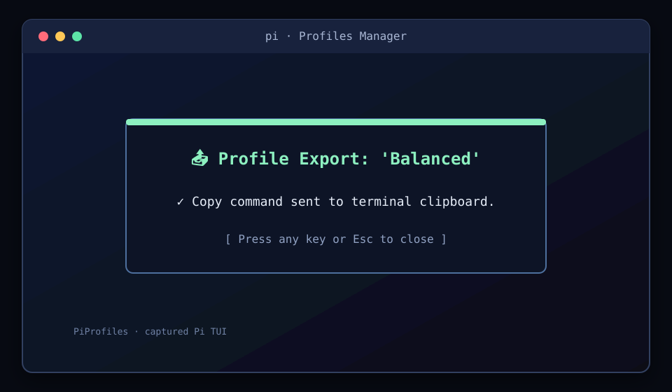

# PiProfiles

**Save the Pi configurations you reach for. Switch them in one keystroke.**

PiProfiles is a [Pi Coding Agent](https://github.com/badlogic/pi-mono) extension for named model profiles. Capture the current orchestrator and subagent routes, edit them in Pi's TUI, then activate, cycle, share, or restore a profile when you need it.

> Built on Pi APIs. Focused on profiles. No fake command ownership, no hidden service.

## Install

Prerequisites:

- Pi Coding Agent
- Node.js 22.19.0 or later (for development)

Install the published extension:

```bash
pi install npm:pi-profiles-manager
```

If Pi is already running, reload the session:

```text
/reload
```

## Quick start

1. Run `/profiles` and choose **Create New Profile from Current Config**.
2. Give the profile a name. It captures the current orchestrator model/thinking level and the current `subagents.json` routes.
3. Open the profile, choose **Edit** to tune routes, or **Set as Favorite** to make it the startup default.
4. Choose **Activate**, or press `ctrl+shift+p` to cycle through profiles.



*Profiles Manager — `PiProfiles · captured Pi TUI`.*

## Commands

PiProfiles registers the public `/profiles` command and these action aliases:

| Command | What it does |
| --- | --- |
| `/profiles` | Open the interactive UI. No arguments open the UI. |
| `/profiles list` | Notify the ordered saved profile names. |
| `/profiles status` | Notify the active profile for this session, or `none`. |
| `/profiles sync` | Reconcile saved profile subagents with `~/.pi/agent/agents/*.md`. |
| `/profiles use <name>` | Activate a saved profile. |
| `/profiles save <name>` | Save the current configuration as `<name>`. |
| `/profiles next` | Activate the next profile in the cycle (or saved order). |
| `/profiles off` | Turn off the active profile for this session and restore its baseline. |

The same actions are also available as registered aliases:

```text
/profiles:list    /profiles:status  /profiles:sync
/profiles:use     /profiles:save    /profiles:next  /profiles:off
```

Argument completion suggests action names after `/profiles`. After `use` or `save`, it suggests matching saved profile names (including names with spaces). Missing arguments for `use` and `save` show usage; an unknown action opens the UI, just like no arguments.

## Keyboard shortcuts

| Shortcut | Action |
| --- | --- |
| `ctrl+shift+p` | Cycle to the next profile (default). |
| Configured shortcut | Cycle to the next profile using a validated modifier-plus-key shortcut. |

Set `shortcut` in `~/.pi/agent/pi-profiles/config.json` to configure it. It can use one or more `ctrl`, `alt`, `shift`, or `meta` modifiers followed by a letter, number, `tab`, or `f1`–`f12`. An invalid configured shortcut falls back to `ctrl+shift+p`; a shortcut registration collision is non-fatal and does not prevent the extension from loading. The legacy `ctrl+alt+p` setting is remapped to the default.

## The UI

The TUI is deliberately direct:

| Flow | Available actions |
| --- | --- |
| Manager | Create from current config, import a profile, open a saved profile, and see active/favorite markers. |
| Profile actions | Activate, set as Favorite (the default profile), edit, export to a string, or delete. |
| Edit | Change the orchestrator or a subagent's model and thinking level; remove a profile subagent; add a subagent. |
| Bulk updates | Select subagents, change their models or thinking levels, review the affected routes, and confirm before applying. |



*Profile actions — `PiProfiles · captured Pi TUI`.*

Each route stores a model as `provider/id` or an explicit model suppression, plus a thinking level: `inherit`, `off`, `minimal`, `low`, `medium`, `high`, `xhigh`, or `max`. Models can be selected from Pi's available models or entered as a custom `provider/id` identifier. Activating an unavailable model or a provider without an API key fails without leaving a half-applied activation; the previous route is restored when possible.



*Profile editing and bulk tools — `PiProfiles · captured Pi TUI`.*

## Data and synchronization

| Path | Role |
| --- | --- |
| `~/.pi/agent/pi-profiles/config.json` | Versioned saved profiles, ordering/cycle, favorite (`defaultProfile`), and shortcut preference. |
| `~/.pi/agent/agents/*.md` | Pi's managed subagent definitions discovered by `/profiles sync`. |
| `~/.pi/agent/subagents.json` | Pi's global active `model_profiles` routes updated when a profile is activated. |

**Managed vs. unmanaged routes.** A route is managed when its subagent name appears in a saved PiProfiles profile. On activation, PiProfiles replaces only those managed `model_profiles` entries with the selected profile's routes. Existing unmanaged entries—including other `model_profiles` entries in `subagents.json`—are preserved. PiProfiles does not claim or rewrite the rest of that file.

`/profiles sync` reads the names of `~/.pi/agent/agents/*.md`, normalizes and sorts them, adds missing entries to every saved profile, and removes entries for deleted agent files. New entries inherit the profile orchestrator model when one exists; otherwise they explicitly suppress a model. Existing route choices are retained. Sync does not create more slash commands.

### Session behavior

Activation is session-scoped. PiProfiles records the active profile, route baseline, and working directory in Pi's session branch when Pi supports that entry, while also keeping live state in memory. At session start it restores the latest matching selection for that session and working directory; if none exists, it applies the favorite/default profile. `/profiles off` records a session-local opt-out, so that session does not immediately fall back to the favorite. Session shutdown clears live state.

## Import and export

Export creates a compact, URL-safe compressed payload with this shape:

```text
piprofile:2:<base64url-deflate-payload>
```

The payload contains the profile routes and whether it is the favorite. **Export** sends the complete string to the terminal clipboard and shows a confirmation screen. **Import** accepts the string from the TUI, validates it, and appends `-imported` when the profile name already exists. Whitespace around or inside the pasted payload is tolerated; malformed or unsupported payloads are rejected.



*Export confirmation — `PiProfiles · captured Pi TUI`.*

## Boundaries

PiProfiles uses Pi APIs and has no direct integration with, or command ownership over, **Gentle AI** or **Joker**. It is not part of and does not modify those plugins. Its only interaction with Pi's shared `subagents.json` is the managed-route reconciliation described above; unmanaged `model_profiles` entries are preserved.

## Troubleshooting / FAQ

**The shortcut does nothing.** Check the configured shortcut's modifier-plus-key format. A collision is intentionally non-fatal, so another Pi extension may already own it; use `/profiles next` instead.

**Why is a profile not applied?** Its model may not be available in Pi's model registry, or the provider may not have an API key. PiProfiles reports the error and rolls back the route when possible.

**A subagent is missing.** Add or remove its `~/.pi/agent/agents/<name>.md` file, then run `/profiles sync`. Names are normalized to lowercase.

**Why did an imported profile get a new name?** Import avoids overwriting an existing profile by appending `-imported`.

**How do I stop startup restoration for this session?** Run `/profiles off`. Set another profile as Favorite in the UI when you want to change the default for future session starts.

## License

MIT © javinnav
